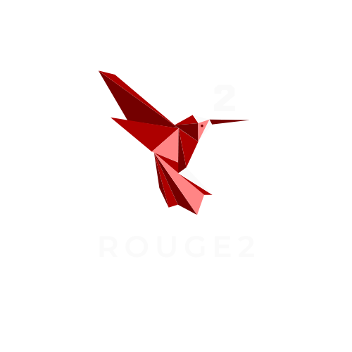

# ROUGE2 Game Engine

This is a 2D game engine currently under development. It leverages OpenGL for rendering, with plans to support other APIs in the future. The engine also utilizes GLFW for window support and the backbone for inputs, ImGui for the user interface, and GLM for mathematical operations.

## Getting Started

To get started with the ROUGE2 Game Engine, follow these steps:

### Prerequisites

- **C++17:** Make sure your compiler supports C++17.
- **Git:** To clone the repository and manage submodules.
- **Premake:** For generating project files.

### Cloning the Repository

Clone the repository with its submodules to ensure all dependencies are included:

    sh
    git clone --recurse-submodules https://github.com/asian-mario/ROUGE2.git
    cd ROUGE2

### Release
This project is currently under heavy development, once I am able to create an able renderer with a somewhat comprehensible GUI I am planning to branch off the project into two sections, a branch focused on rendering power (which will implement 3D) and a general engine.